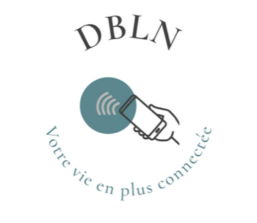
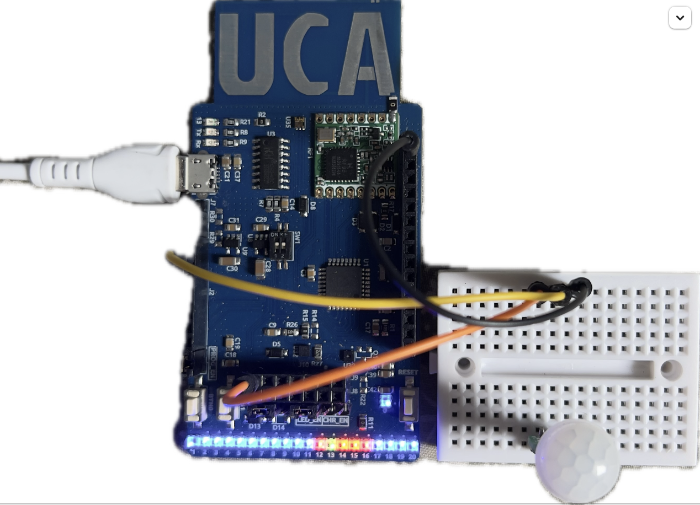

# projet Arduino

Ce projet est réalisé dans le cadre du module Communication Sans Fil en Licence 1 à l'Université Côte D'Azur. Notre projet a pour objectif de connecte différents capteurs à une interface connectée afin de faciliter le quotidien des utilisateurs en utilisant une carte Arduino, des capteurs et des LEDs pour surveiller et interagir avec l'environnement.


<p align="center">
  
</p>

##  Matériel utilisé

- Carte Arduino UCA Côte d’Azur
- Capteur de température et d’humidité SHTC3
- Capteur de mouvement PIR
- Capteur de luminosité LTR-303
- Bandeau LED RGB
- Câbles, alimentation, breadboard

##  Fonctionnalités

-  Lecture de la température et de l’humidité ambiantes
-  Mesure de la luminosité
-  Contrôle automatique ou manuel d’un ruban LED
-  Affichage des données sur le port série ou sur écran LCD (optionnel)

## Démarrage

1. Cloner ce dépôt :
   ```bash
   git clone https://github.com/minidividu/maison-connectee-arduino.git


  ##  Représentation visuelle du montage



---

##  Détails des connexions

| Fil      | Couleur | Connecté à         | Fonction                   |
|----------|---------|--------------------|----------------------------|
| GND      | Noir    | GND de la carte    | Masse électrique           |
| Signal   | Jaune   | A3 de l'Arduino    | Entrée analogique capteur  |
| Alim     | Orange  | USB de la carte    | Alimentation 5V / données  |

---

##  Composants nécessaires

- 1 × Arduino UNO
- 1 × Capteur [PIR]
- 3 × Fils (noir, jaune, orange)
- 1 × Câble USB
