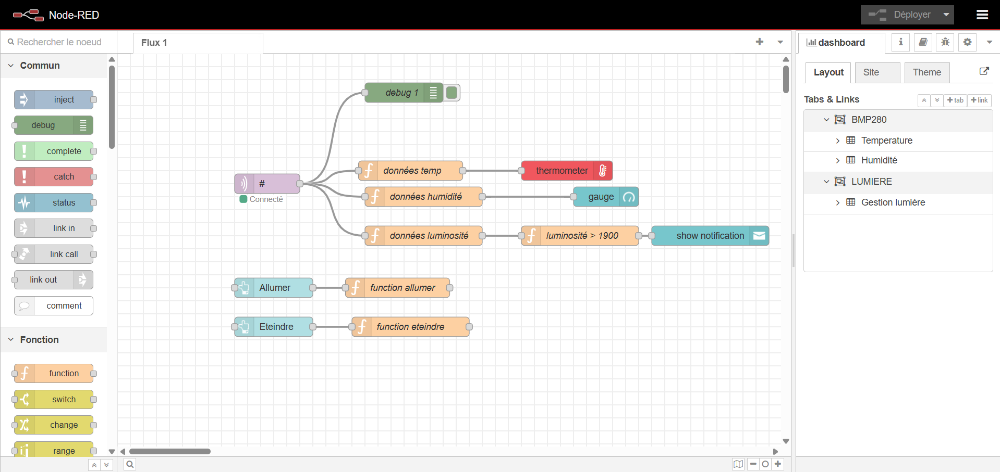

# Installation de Node-red et présentation des fonctions

Tout d'abord pour utiliser Node-red il faut avoir installer Node.js au préalable.
Node-red est un outil qui permet de relier des périphériques matériels à des services en lignes avec du low code.

Pour installer Node-red, il faut ouvrir l'invite de commande de votre ordinateur entrer cette commande:
 * npm install -g --unsafe-perm node-red

Une fois tous les packets installer, il suffit d'entrer la commande : node-red et d'ouvrir un navigateur et d'entrer l'url : http://127.0.0.1:1880/

Vous allez atterrir sur l'interface de node-red

  

Afin de pouvoir récupérer les données envoyer à TTN nous avons utilisé un noeud MQTT.
MQTT est un protocole de messagerie publication-abonnement basé sur le protocole TCP/IP. Il est l'un des protocoles clés dans le déploiement de l'internet des objets.

Pour configurer le noeud nous avons récupérer l'adresse publique, le nom d'utilisateur et l'API key de notre application depuis The Things Network que l'on retrouve dans l'onglet "Integration" sur la gauche

"Image TTN integration"
"Images nodered config"

# Fonctions

## Donées

Les données sont reçues sous forme de tableau, donc pour récupérer celle qui nous intéresse on a utilisé 3 fonctions différentes:

"Images des fonctions"

## Notifications

Pour la notification lorsque la luminosité ambiante est suffisante :

"Image de la fonction"

# Dashboard

Afin de pouvoir visualer nos données et les effets de nos fonctions nous avons utilisé les noeuds d'un dashboard installer

"Image dashboard1"

Ensuite dans l'onglet installer, rechercher dashboard

"Image dashboard2"

Enfin il suffit de choisir les noeuds souhaiter et de les configurer (ils sont disponibles sur la gauche)

Pour visualiser le résultat il faut cliquer sur déployer puis aller dans l'onglet dashboard et cliquer sur l'icone ouvrir dans un nouvel onglet

"Images deploi"

